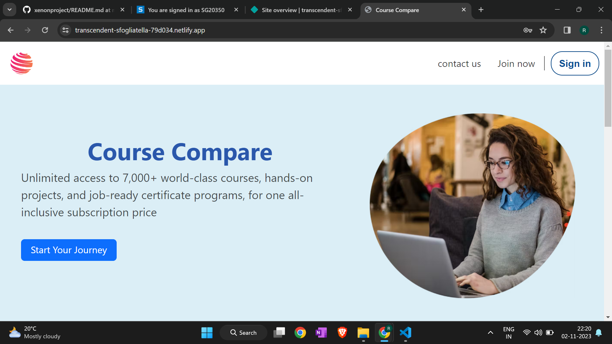
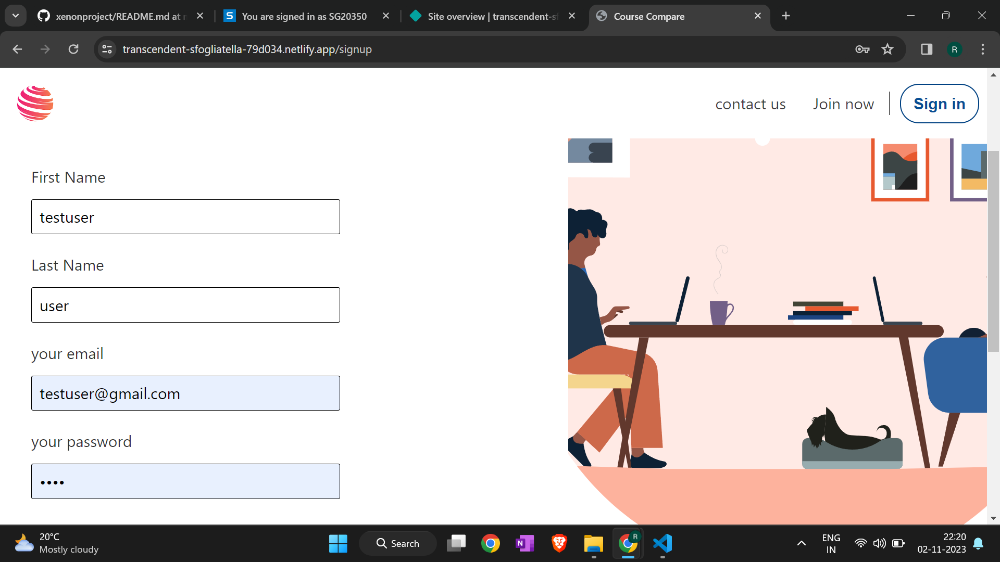
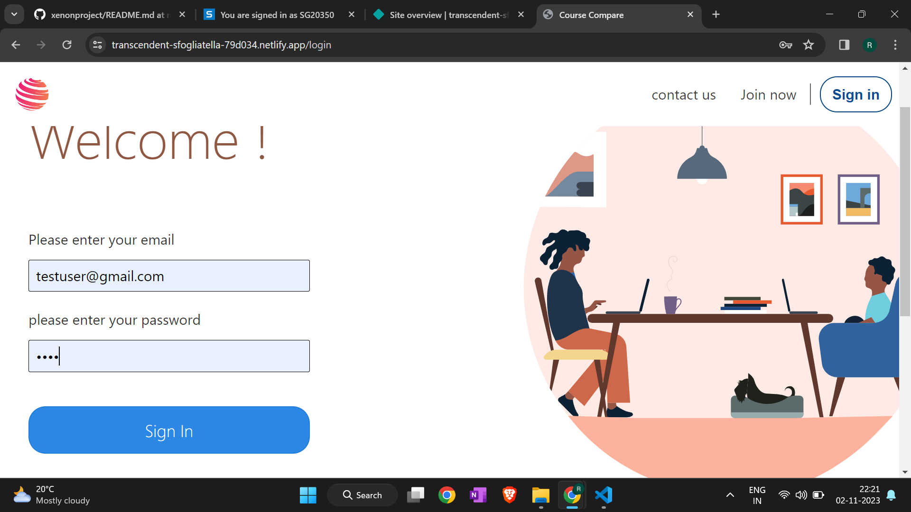
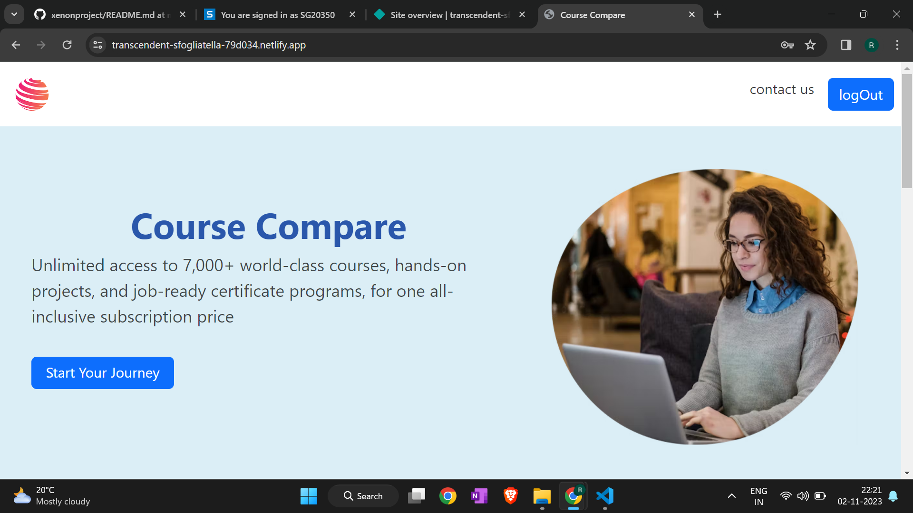
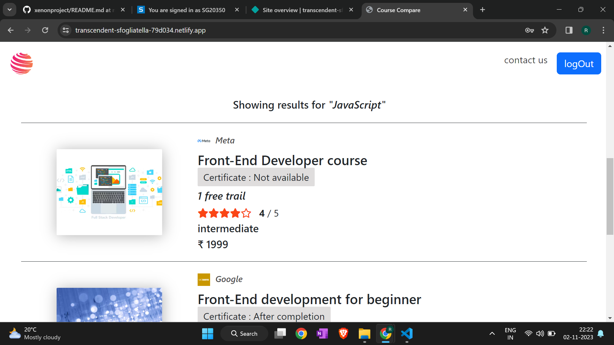
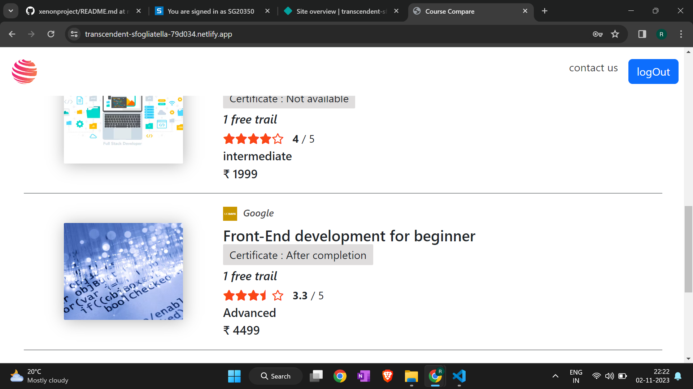

# XenonLearn (https://transcendent-sfogliatella-79d034.netlify.app/)

## Description

XenonLearn is a user-friendly web application designed to help both instructors and learners connect in a seamless educational environment. With a clean and intuitive interface, Learnify offers a straightforward platform for instructors to showcase their courses and for learners to discover and enroll in their preferred subjects.

## Table of Contents

- [Features](#features)
- [Technology Used](technology-used)
- [File Structure](#file-structure)
- [Installation](#installation)
- [Testuser](#testuser)
- [Usage](#usage)
- [License](#license)

## Features

User Authentication and Registration:
- User accounts with unique usernames and passwords.
- Options for users to register using email, social media accounts, or other authentication methods.

Course Catalog:
- A searchable and categorized list of available courses presented with clear titles, descriptions, and instructor details.
- Filter options for sorting by subject, level, duration, etc.
- Engage with comprehensive course overviews, including curriculum, prerequisites, and user reviews

Content Recommendations:
- Personalized course recommendations based on user preferences, browsing history, and behavior.

Admin Dashboard:
- Backend interface for administrators to manage users, courses, content, and settings.

## Technologies Used
Frontend:
- React.js
- CSS for styling
  
Backend:
- Node.js
- Express.js
- MongoDB

Additional Libraries:
- Axios for HTTP requests
- React Router for client-side routing
  
## File Structure

- client/: Frontend codebase.
- server/: Backend codebase.
- client/public/: Static assets.
- client/src/: React components and application logic.
- server/config/: Configuration files.
- server/controllers/: Controllers for handling routes.
- server/models/: Mongoose models for MongoDB.
- server/routes/: Express.js route definitions.
- .gitignore: Ignored files and directories for version control.
- package.json: Project configuration and dependencies.
- README.md: Project documentation.

## Installation

What are the steps required to install your project? Provide a step-by-step description of how to get the development environment running.

## Test user

email: testuser@gmail.com  
password : test

## Usage
### Home Page

### Sign Up page

### Sign in page

### Logged in Home Page

### Course Cards

### Contact us page

    
  
## License
This project is under [MIT License](MIT License)

